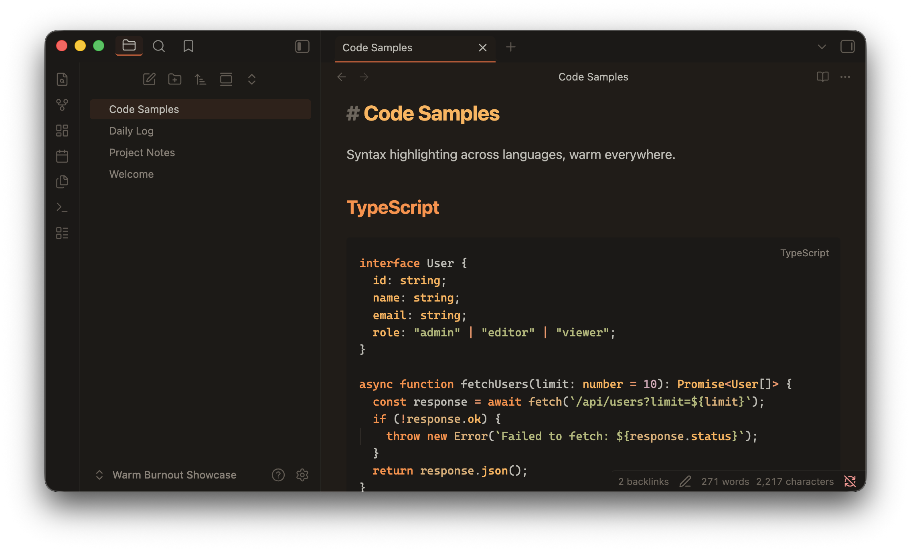
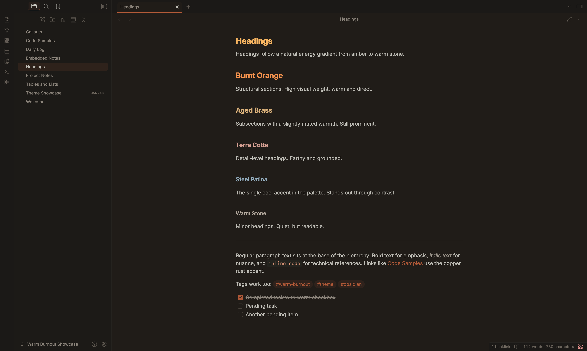
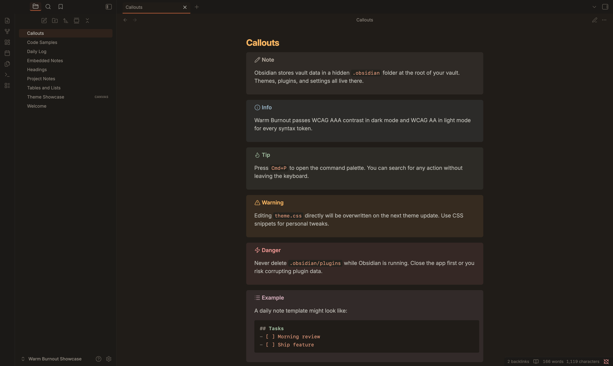
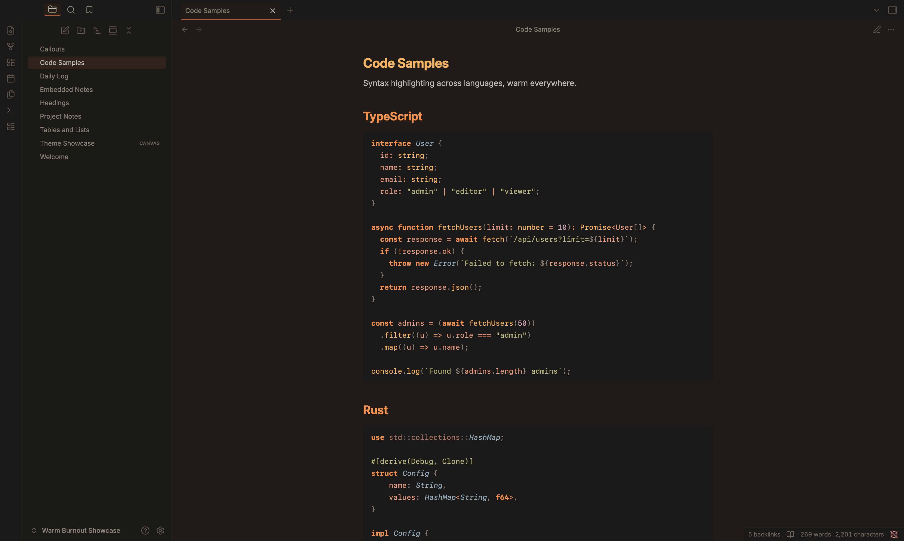
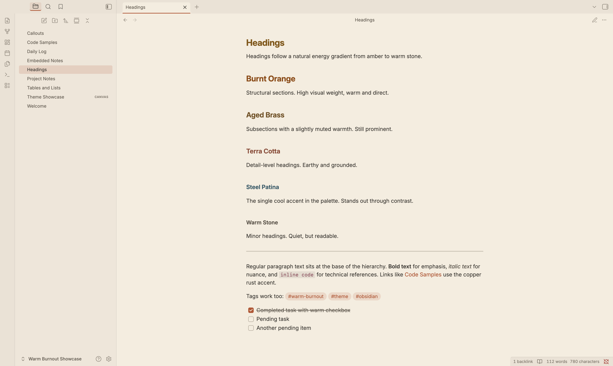
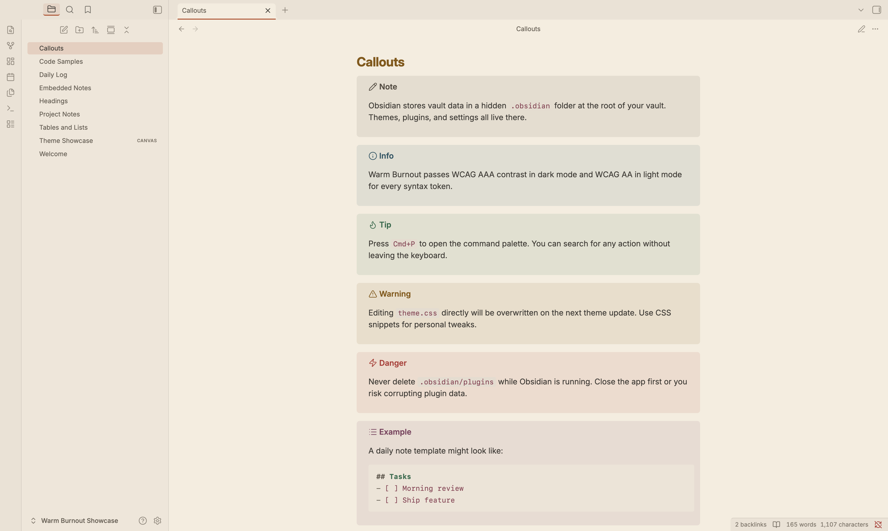
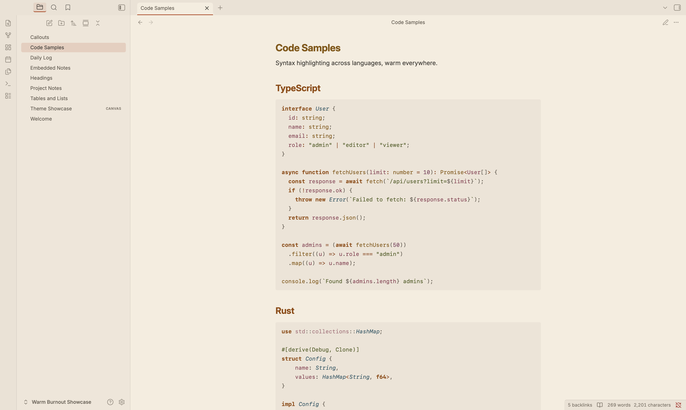

# Warm Burnout for Obsidian

Your second brain was running on factory-default colors. Cold blues, harsh whites, zero consideration for 2am rabbit holes through your note graph. Fixed.

Full community theme for Obsidian with dark and light variants. Warm palette, contrast-audited, zero blues in the chrome.

## Contents

- [Screenshots](#screenshots)
- [Install](#install)
- [Features](#features)
- [Fonts](#fonts)
- [Palette](#palette)
- [Requirements](#requirements)

## Screenshots

### Dark

| Headings | Callouts | Code |
|----------|----------|------|
|  |  |  |

### Light

| Headings | Callouts | Code |
|----------|----------|------|
|  |  |  |

## Install

### Community Themes (recommended)

1. Open Settings > Appearance > Themes
2. Click "Manage" and search for **Warm Burnout**
3. Install and activate

### Manual

1. Download `theme.css`, `manifest.json`, and the `fonts/` folder from the [latest release](https://github.com/felipefdl/warm-burnout/releases)
2. Create a folder called `Warm Burnout` inside your vault's `.obsidian/themes/` directory
3. Place `theme.css`, `manifest.json`, and the `fonts/` folder in it
4. Open Settings > Appearance > Themes and select **Warm Burnout**

## Features

### Heading gradient

Headings follow a natural energy gradient from amber down to warm stone. Visual weight decreases with each level, so your note structure is readable at a glance.

| Level | Color | Name |
|-------|-------|------|
| H1 | `#ffb454` | Amber |
| H2 | `#ff8f40` | Burnt Orange |
| H3 | `#deb074` | Aged Brass |
| H4 | `#dc9e92` | Terra Cotta |
| H5 | `#90aec0` | Steel Patina |
| H6 | `#b4a89c` | Warm Stone |

### Callouts

All 12 callout types are themed with warm palette colors. Info, tip, warning, error, example, question, success, quote, summary, todo, bug, and fail all map to distinct palette entries so they stay distinguishable without fighting the warm aesthetic.

### Syntax highlighting

Full syntax palette in both editing and reading views. Functions = amber, keywords = burnt orange, strings = dried sage, types = steel patina. Both Prism.js (reading view) and CodeMirror 6 (editing view) token systems are covered.

### Graph view

Graph nodes use the copper rust accent. Focused nodes glow amber. Tags get dried sage, attachments get dusty mauve. Lines and text stay muted so the structure reads clearly against the warm background.

### Canvas

Six card colors mapped to palette entries: copper rust, amber, dried sage, steel patina, dusty mauve, and coral. The dot pattern uses the surface ramp so it stays warm.

### Surface hierarchy

13-step warm ramp from deep brown-black to warm cream. No neutral grays anywhere. Every intermediate carries warm undertone.

Dark background: `#1a1510`. Light background: `#F5EDE0`. Accent: `#b8522e` (copper rust).

### Warm everywhere

Tinted shadows, warm scrollbar tracks, soft selection highlights, warm cursor (gold, not red). Tags, checkboxes, metadata, blockquotes, embeds, tooltips, modals, prompts: all warm.

## Fonts

The theme ships with two bundled fonts so your vault looks consistent without installing anything:

- **Inter** (interface and body text): clean geometric sans-serif, closest open-source match to SF Pro. Designed for screens.
- **Geist Mono** (code blocks): clean monospace by Vercel, closest open-source match to SF Mono.

Both are variable fonts (single file, all weights) in woff2 format. Licensed under the SIL Open Font License.

You can override these in Settings > Appearance > Font at any time. The bundled fonts are defaults, not locked in.

## Palette

Both variants derive from the canonical Warm Burnout palette defined in the [main repository](https://github.com/felipefdl/warm-burnout).

| Material | Dark | Light | Used for |
|----------|------|-------|----------|
| Amber | `#ffb454` | `#855700` | Functions, H1 |
| Burnt Orange | `#ff8f40` | `#924800` | Keywords, H2 |
| Aged Brass | `#deb074` | `#74501c` | CSS properties, H3 |
| Terra Cotta | `#dc9e92` | `#8e4632` | HTML tags, H4 |
| Steel Patina | `#90aec0` | `#285464` | Types/classes, H5 |
| Warm Stone | `#b4a89c` | `#544c40` | Comments, H6 |
| Dried Sage | `#b4bc78` | `#4d5c1a` | Strings |
| Verdigris | `#96b898` | `#286a48` | Regex, escapes |
| Dusty Mauve | `#d4a8b8` | `#7e4060` | Numbers, constants |
| Coral | `#ec9878` | `#883850` | Member variables |
| Gold | `#e6c08a` | `#7a5a1c` | Decorators |
| Copper Rust | `#b8522e` | `#b8522e` | Accent, links, interactive |

## Requirements

Obsidian 1.0.0 or later.

## License

[MIT](../LICENSE). Part of the [Warm Burnout](https://github.com/felipefdl/warm-burnout) theme suite.
